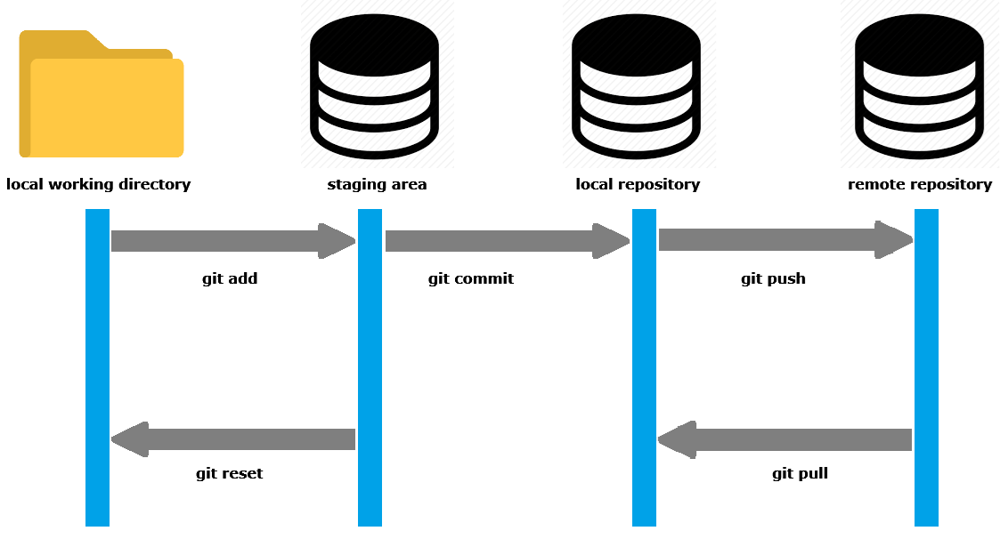
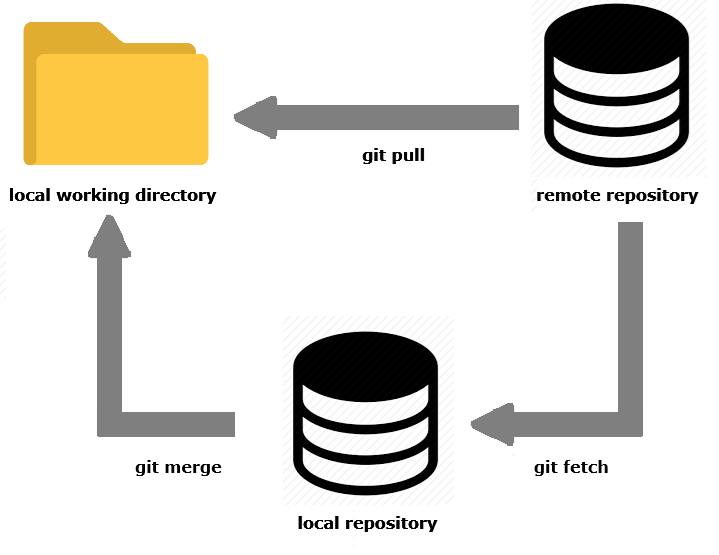

# Git notes
						  

How to overwrite local git branch. Step by step guide to overwrite local git branch. Suppose you have modification in your local repo. And there are changes ready to be pulled from remote repo.

{:style="width: 100%; display: block;float: none;margin-left: auto;margin-right: auto;margin-top: 50px;margin-bottom: 50px;"} 

Fetch remote state
=================================================================
First to fetch the latest state into local repo enter the following command. 
Note that remote changes are not merged into your local directory yet. This updates your remote tracking branches (origin/main, origin/feature-branch, etc.).
~~~~~~~~~~~~~~~~~~~~~~~~~~~~~~~~~~~
git fetch origin
~~~~~~~~~~~~~~~~~~~~~~~~~~~~~~~~~~~

Checkout the branch 
==============================================================

Checkout the branch which you want to reset to the remote branch state.  
~~~~~~~~~~~~~~~~~~~~~~~~~~~~~~~~~~~
git checkout branch-name
~~~~~~~~~~~~~~~~~~~~~~~~~~~~~~~~~~~

Local branch hard reset
==============================================================

Overwrite local branch by doing a hard reset via --hard option which resets the index and working tree.
All changes in tracked files since the commit are discarded. This command resets the current branch's head to the specified commit (in this case, the latest commit of the branch on the remote).

{:style="width: 100%; display: block;float: none;margin-left: auto;margin-right: auto;margin-top: 50px;margin-bottom: 50px;"} 
~~~~~~~~~~~~~~~~~~~~~~~~~~~~~~~~~~~
git reset --hard origin/branch-name
~~~~~~~~~~~~~~~~~~~~~~~~~~~~~~~~~~~

Clean working directory 
==============================================================

For the untracked files in the working directory use git clean command (-f means force and -d is for directories). 
~~~~~~~~~~~~~~~~~~~~~~~~~~~~~~~~~~~
git clean -fd
~~~~~~~~~~~~~~~~~~~~~~~~~~~~~~~~~~~
Now your working directory branch is up to date with the remote branch origin/branch-name (nothing to commit and up to date with latest changes). 
To check the current state of your working directory:
~~~~~~~~~~~~~~~~~~~~~~~~~~~~~~~~~~~
git status
~~~~~~~~~~~~~~~~~~~~~~~~~~~~~~~~~~~
To show the remote url use the following command.
----------------------------------------------------
~~~~~~~~~~~~~~~~~~~~~~~~~~~~~~~~~~~
git config --get remote.origin.url
~~~~~~~~~~~~~~~~~~~~~~~~~~~~~~~~~~~
Alternatively for a full output 
~~~~~~~~~~~~~~~~~~~~~~~~~~~~~~~~~~~
git remote show origin
~~~~~~~~~~~~~~~~~~~~~~~~~~~~~~~~~~~

