---------------------------------
2026.10.12 (Mon) 21:20
IST
Istanbul
(Istanbul Airport)
KE 956
2026.10.13 (Tue) 13:25
ICN
Seoul
(Incheon)
Seat Number	50D
---------------------------------

---------------------------------
2026.10.13 (Tue) 20:30
ICN
Seoul
(Incheon)
KE 751
2026.10.13 (Tue) 22:50
HND
Tokyo
(Tokyo Haneda Intl)
Seat Number	39A
---------------------------------

---------------------------------
2026.10.24 (Sat) 09:05
KIX
Osaka
(Osaka Kansai International Airport)
KE 722
2026.10.24 (Sat) 10:55
ICN
Seoul
(Incheon)
Seat Number	44F
---------------------------------

---------------------------------
2026.10.24 (Sat) 13:40
ICN
Seoul
(Incheon)
KE 955
2026.10.24 (Sat) 19:40
IST
Istanbul
(Istanbul Airport)
Seat Number	42D
---------------------------------

# Otel

* jr line üzerinde ueno tokyo yakınları shiniiku shibuya harajuku akiabara yakın otel
* 4 üzeri iyidir apa hotels
* otel için hinjiku tarafı akşam hareketli yemek bulmak açısından
  
# Ulaşım

* Osaka'ya gidiş (Tokyo dışına ulaşım) : [Shinkansen app](https://smart-ex.jp/en/lp/app/)
* welcome suica kart al 2 tane, depozitolu olan değil
* jr yamanote line
* havaalani tokyo için narita express

# POI

| TOKYO | Görsel | Notlar |
| :--- | :---: | :--- |
| Tokyo Metropolitan Government Building Observatory | 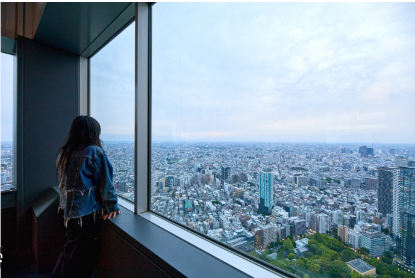 | Ücretsiz. Shinjuku'da. Akşam git |
| Godzilla head | 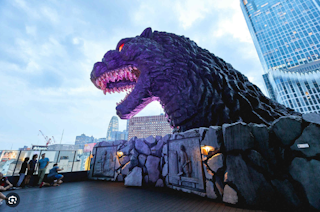 | Kabukishoyu izleyen dev godzilla |
| Hanazona Shrine | 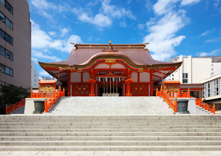 | Tapınak |
| Shinjuku Golden Gai | 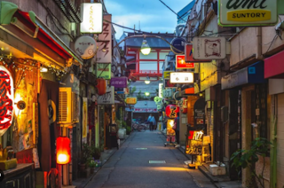 | Dar Sokaklar |
| Tokyo Skytree | 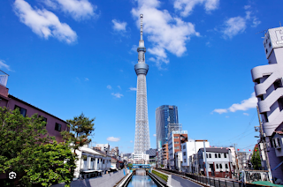 | Sky deck |
| Senso-Ji Temple | 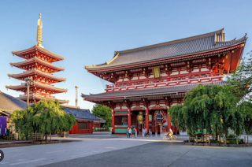 | Asakusa |
| Shibuya crossing | 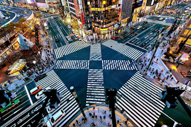 | Meydan yaya geçidi |
| Meiji Jingu | 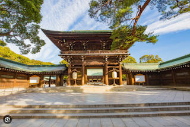 | Tapınak |
| Kabukicho Tower | 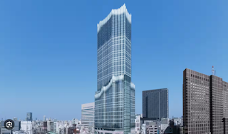 | Kule |
| Teamlab Planets | 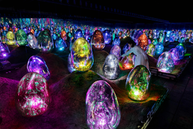 | Müze |
| Asakusa Shrine | 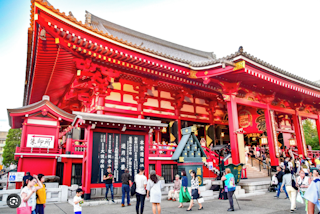 | Tapınak |
| Akiabara Electronic Town | 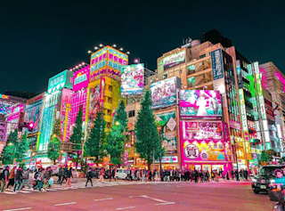 | Alışveriş |
| Shibuya Sky | 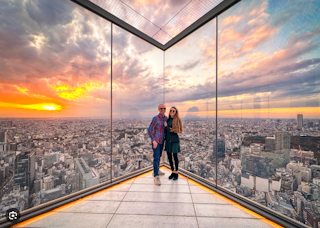 | Sky deck |

| KYOTO | Görsel | Notlar |
| :--- | :---: | :--- |
| Fushimi Inari Taisha | 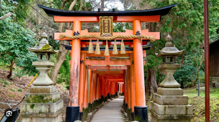 | Hiking |
| Arashiyama Bamboo Grove | 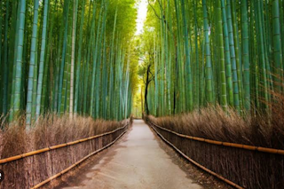 | Hiking |
| Kinkaku-ji (Golden Pavilion) |  |  |
| Gion District |  |  |
| Nishiki Market |  |  |
| Nijo Castle |  |  |
| Heian Shrine |  |  |
| Togetsukyo Bridge |  |  |
| Kiyomuzu-Dera Temple |  | manzara (ücretli) |

| OSAKA | Görsel | Notlar |
| :--- | :---: | :--- |
| Osaka Castle | 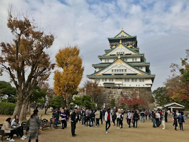 | Müze (ücretli) |
| Dotonbori | 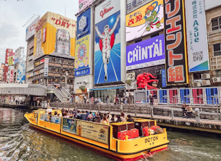 | Nehir cruise gezi |
| Kuromon Ichiba Pazarı |  |  |
| Tennoji zoo |  |  |

| NARA | Görsel | Notlar |
| :--- | :---: | :--- |
| Nara Park | 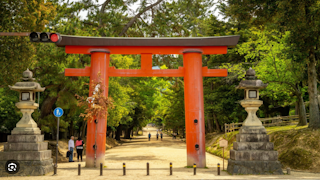 | Geyik Parkı |
| Todai-ji Temple | 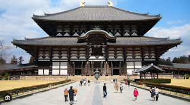 | Tapınak |
| Kasuga Taisha |  |  |
| Kofuku-ji |  |  |
| Mount Wakakusa |  |  |
| Naramachi Old Town |  |  |
| Nara Prison Museum |  |  |
| Yashino Mountain |  |  |
