# Gidiş

| Kalkış saati | Kalkış Havalimanı | Uçuş | İniş saati | İniş Havalimanı |
| :--- | :---: | :--- | :--- | :--- |
| 2026.10.12 (Mon) 21:20 | IST Istanbul | KE 956 | 2026.10.13 (Tue) 13:25 | ICN Seoul Incheon |
| 2026.10.13 (Tue) 20:30 | ICN Seoul Incheon | KE 751 | 2026.10.13 (Tue) 22:50 | HND Tokyo Haneda |

# Dönüş

| Kalkış saati | Kalkış Havalimanı | Uçuş | İniş saati | İniş Havalimanı |
| :--- | :---: | :--- | :--- | :--- |
| 2026.10.24 (Sat) 09:05 | KIX Osaka Kansai | KE 722 | 2026.10.24 (Sat) 10:55 | ICN Seoul Incheon |
| 2026.10.24 (Sat) 13:40 | ICN Seoul Incheon | KE 955 | 2026.10.24 (Sat) 19:40 | IST Istanbul |

# Otel

* jr line üzerinde ueno tokyo yakınları shiniiku shibuya harajuku akiabara yakın otel
* 4 üzeri iyidir apa hotels
* otel için hinjiku tarafı akşam hareketli yemek bulmak açısından
  
# Ulaşım

* Osaka'ya gidiş (Tokyo dışına ulaşım) : [Shinkansen app](https://smart-ex.jp/en/lp/app/)
* welcome suica kart al 2 tane, depozitolu olan değil
* jr yamanote line
* havaalani tokyo için narita express

# POI

| TOKYO | Görsel | Notlar |
| :--- | :---: | :--- |
| Tokyo Metropolitan Government Building Observatory | 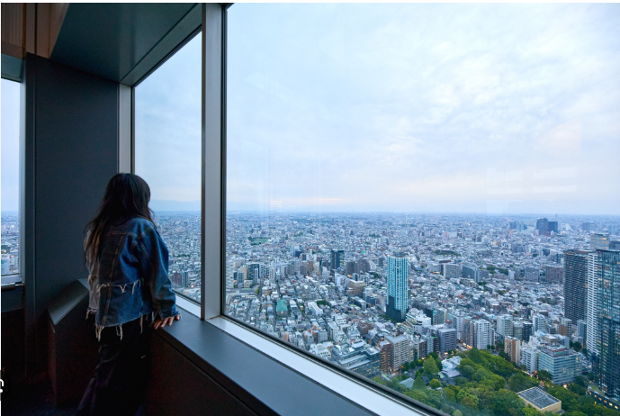 | Ücretsiz. Shinjuku'da. Akşam git |
| Godzilla head | 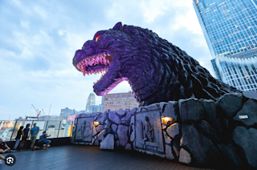 | Kabukishoyu izleyen dev godzilla |
| Hanazona Shrine | 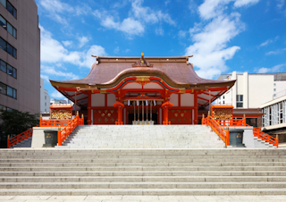 | Tapınak |
| Shinjuku Golden Gai | 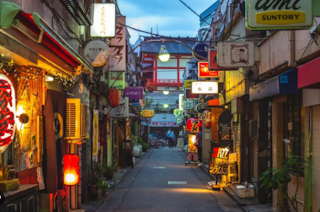 | Dar Sokaklar |
| Tokyo Skytree | 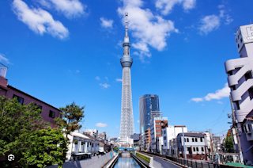 | Sky deck |
| Senso-Ji Temple | 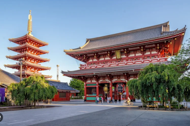 | Asakusa |
| Shibuya crossing | 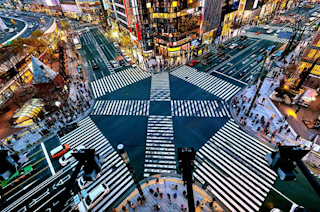 | Meydan yaya geçidi |
| Meiji Jingu | 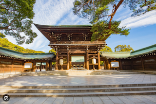 | Tapınak |
| Kabukicho Tower | 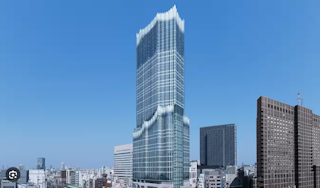 | Kule |
| Teamlab Planets | 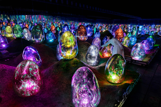 | Müze |
| Asakusa Shrine | 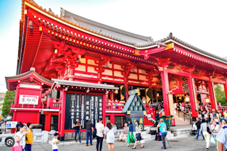 | Tapınak |
| Akiabara Electronic Town | 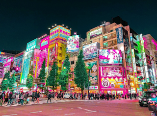 | Alışveriş |
| Shibuya Sky | 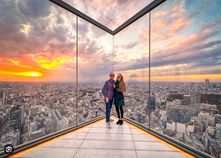 | Sky deck |

~
=====================================

| KYOTO | Görsel | Notlar |
| :--- | :---: | :--- |
| Fushimi Inari Taisha | 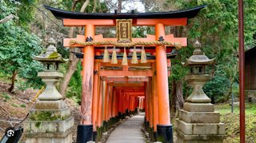 | Hiking |
| Arashiyama Bamboo Grove | 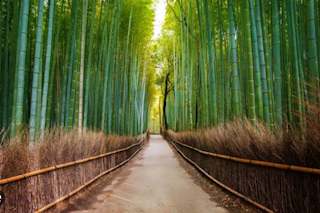 | Hiking |
| Kinkaku-ji (Golden Pavilion) | 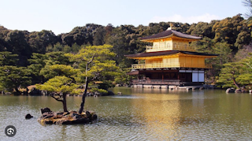 | Tapınak |
| Gion District | 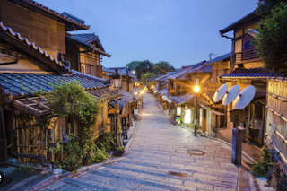 | Alışveriş |
| Nishiki Market | 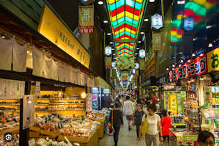 | Alışveriş |
| Nijo Castle | 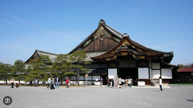 | Kale |
| Heian Shrine | 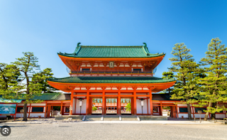 | Tapınak |
| Togetsukyo Bridge | 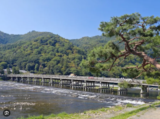 | Köprü |
| Kiyomuzu-Dera Temple | 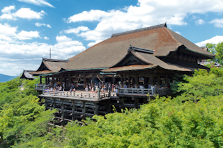 | manzara (ücretli) |

~
=====================================

| OSAKA | Görsel | Notlar |
| :--- | :---: | :--- |
| Osaka Castle | 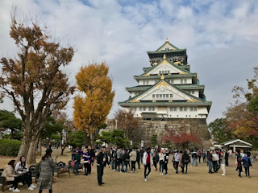 | Müze (ücretli) |
| Dotonbori | 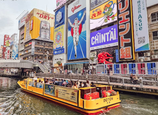 | Nehir cruise gezi |
| Kuromon Ichiba Pazarı | 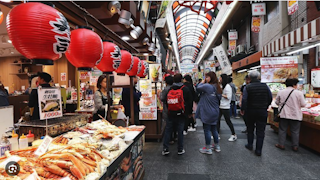 | Alışveriş |
| Tennoji zoo | 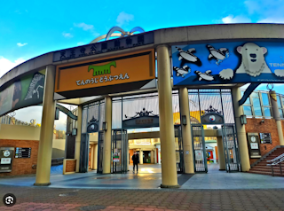 | Zoo |

~
=====================================

| NARA | Görsel | Notlar |
| :--- | :---: | :--- |
| Nara Park | 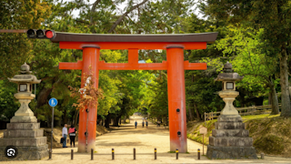 | Geyik Parkı |
| Todai-ji Temple | 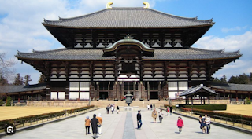 | Tapınak |
| Kasuga Taisha | 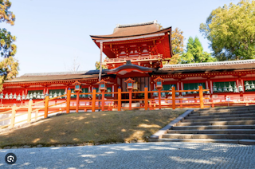 | Tapınak |
| Kofuku-ji | 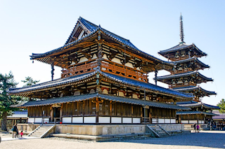 | Tapınak |
| Mount Wakakusa | 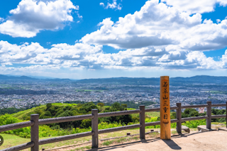 | Dağ |
| Naramachi Old Town | 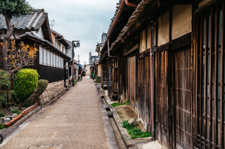 | Old Town Yürüyüş |
| Nara Prison Museum | 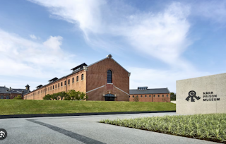 | Müze |
| Yoshinoyama Mountain | 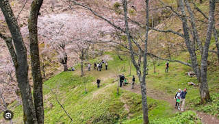 | Dağ |

## Retro Games 

Gameboy Color handheld with games (also fully compatible with Gameboy classic games)
----------------

* Super Mario Land (GB)
* Super Mario Land 2: Six Golden Coins (GB)
* Super Mario Bros. Deluxe (GBC)
* The Legend of Zelda: Link's Awakening DX (GBC)
* The Legend of Zelda: Oracle of Ages & Oracle of Seasons (GBC)

SNES (Super Famicom) console with Games 
-------------

* POWER: MUST USE ORIGINAL Sega Mega Drive Model 1 power supply (from the PAL/European region) in Turkiye
* Video : needs an upscaler to convert from analog to HDMI/4K
* 
* Street Fighter II Turbo: Hyper Fighting (1993)
* The Legend of Zelda: A Link to the Past
* Super Mario World
* Super Mario World Yoshi's Island
* Chrono Trigger Square
* Donkey Kong Country 2: Diddy's Kong Quest
* Mega Man X
* Super Metroid

Nintendo 64 console - 
----------------------

* POWER : must use European (PAL) Nintendo 64 power supply in Turkiye
* Video : needs an upscaler to convert from analog to HDMI/4K
* 
* The Legend of Zelda: Ocarina of Time
* Mario Kart 64
* Super Mario 64

Nintendo Switch game cartridges
-------------------------------------
* Nintendo Switch hardware is not region-locked for physical game cards, so a Japanese cartridge will work on any standard Switch console worldwide
* Many Japanese cartridges include English or match your console's system language, but some titles (especially text-heavy RPGs or specific third-party games) only support Japanese. check the back of the physical game case for supported languages

🏷️ Condition Grading System (Look at the price tags!)
------------------------------------------
 * Rank S: Brand new / Mint in box
 * Rank A: Pristine, minimal wear
 * Rank B: Normal wear, small scratches
 * Rank C: Heavy cosmetic damage, works fine
 * ジャンク (Junk): Untested or broken (Buy at own risk!)
